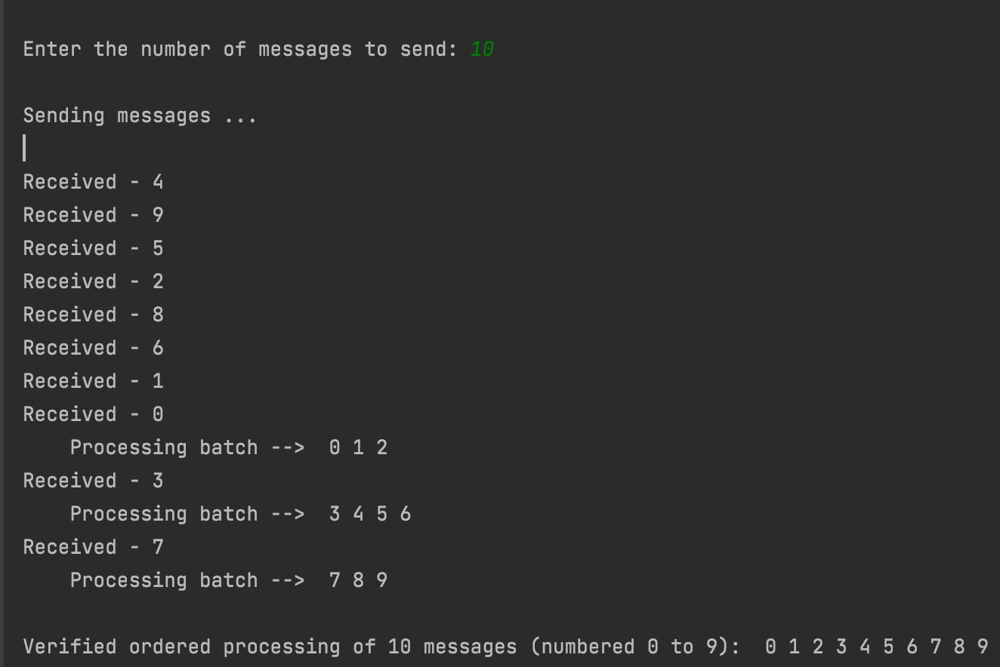

#Message Collator Take-Home Assignment
A message processing component receives an unknown number of messages that are numbered from 0..N, one at a time. 
The value of N is unknown. Delivery is reliable in the sense that all messages will eventually be received. 
However, the order in which they are received can be completely random.

All messages are to be handed off to a Processor with an interface like the following:
process(List<Message> batch)

Any number of batches can be submitted to the processor, however:

All messages in a given batch must be in order, with no gaps

Batches must be in the proper order, with no gaps

For example, if the first batch of messages sent to the Processor contains messages 0..3, 
the next batch must start with message 4. There is no minimum or maximum batch size.

Your task is to complete a collating Listener that receives a single message, 
buffers it in a datastructure (of your choosing) and from time to time submits 
a valid batch of buffered messages to the processor.

##Message Input
The Message object has two properties: an order number and a message. 
A MessageGenerator class creates a Message ArrayList of size N and uses Collections.shuffle() 
to put the Messages in random order. 

The number of messages to be sent is input by the user at runtime.

##Message Processing
Messages are received by a Listener object that inserts the Message into
an ArrayList in chronological order. Messages can be inserted in O(n) time. 

After each message is inserted, the application evaluates whether the next 
ordered message is available to process.

If the next message m has been received and is available to process, a check
increments the next expected values and looks for the presence of m+1
in the received messages. 

The available ordered messages are then batched and processed.

A Processor object receives the batch and verifies the batch is in correct 
order and that the batch begins with the next expected message number. 

##Output
The application displays the order the messages are received and subsequently processed.

